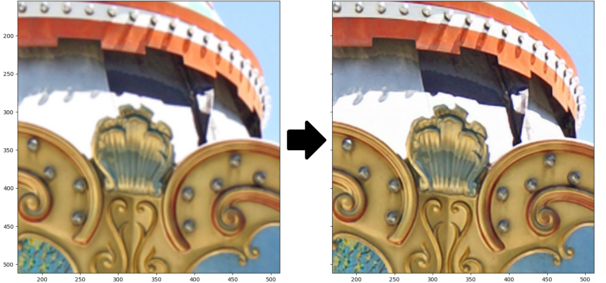

# Hollistic Attention Network

Implementation of the HAN-like network architecture proposed in https://arxiv.org/abs/2008.08767 to create super resolution images. To speed up training/evaluation, the network was built with fewer residual attention blocks (64 instead of 200 residual channel attention blocks).

## Training

The network was trained using 96x96 patches from the DIV2K dataset. During training, the input is downsampled by the scale factor, the fed in as a lower resolution image. To virtually increase the size of the dataset, the images are randomly horizontally flipped and rotated.

## Results
The peak signal to noise ratio (PSNR) and structural similarity (SSIM) were calculated using only the luminance channel of the [YCbCr color space](https://en.wikipedia.org/wiki/YCbCr).

#### x2

|Dataset|Set5|Set14|Urban100|BSDS100|Manga109|
|----|----:|----:|----:|----:|----:|
|PSNR|38.5661|33.0571|32.3992|33.6106|36.6606|
|SSIM|0.9721|0.9266|0.9248|0.9187|0.9757|

#### x3
|Dataset|Set5|Set14|Urban100|BSDS100|Manga109|
|----|----:|----:|----:|----:|----:|
|PSNR|28.8774|26.4848|24.0927|27.0797|27.2324|
|SSIM|0.8749|0.7916|0.7274|0.7545|0.8878|

#### High resolution (left) vs Super resolution (right) using the x2 model.

